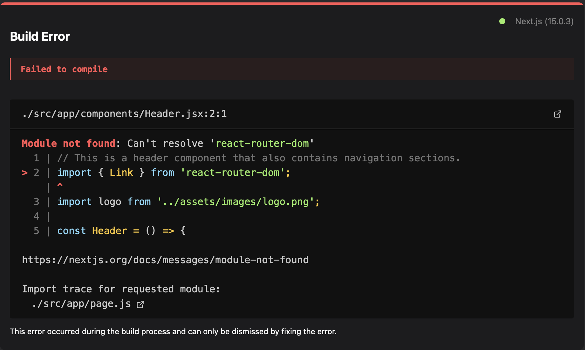
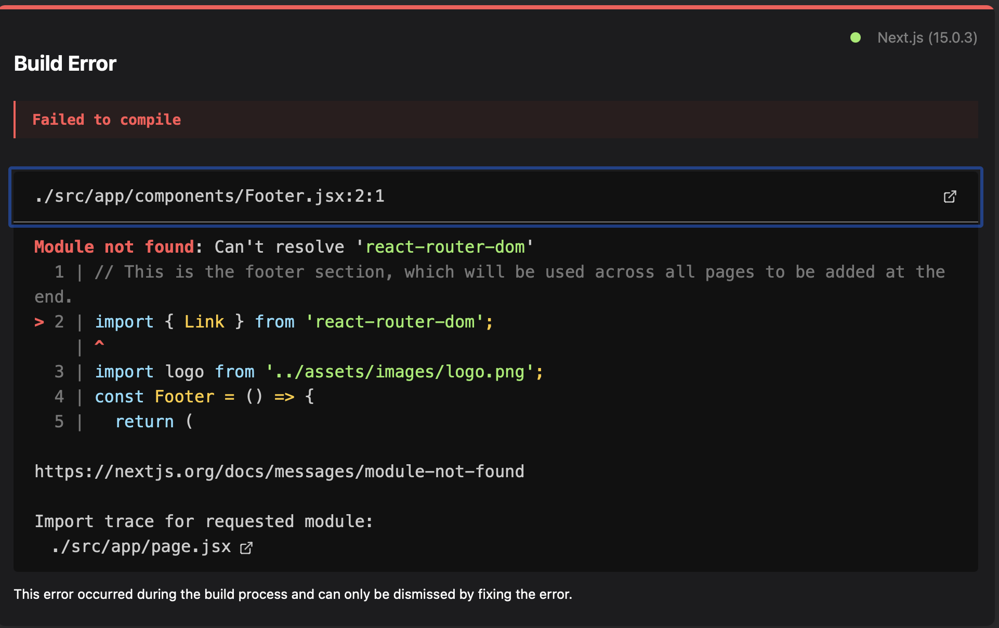
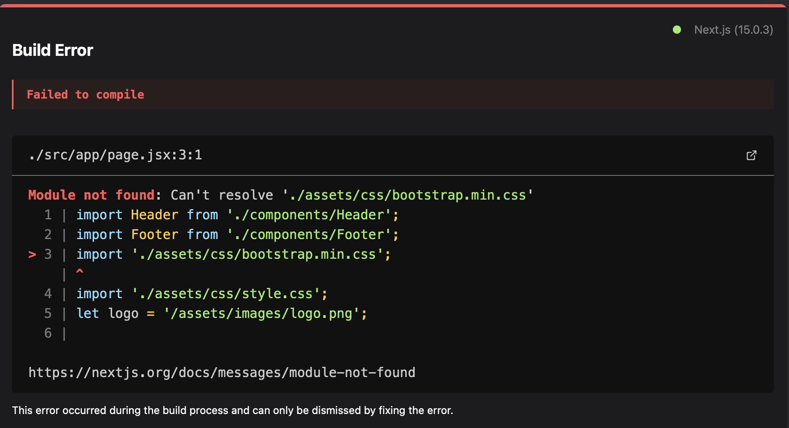
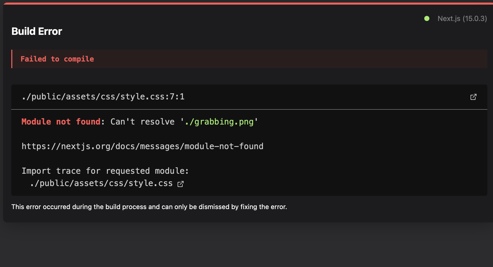
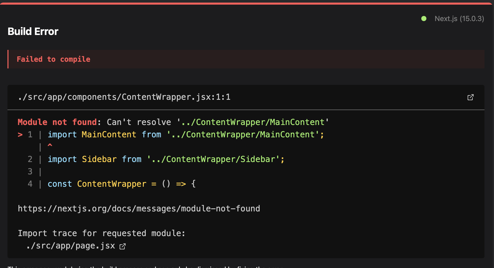
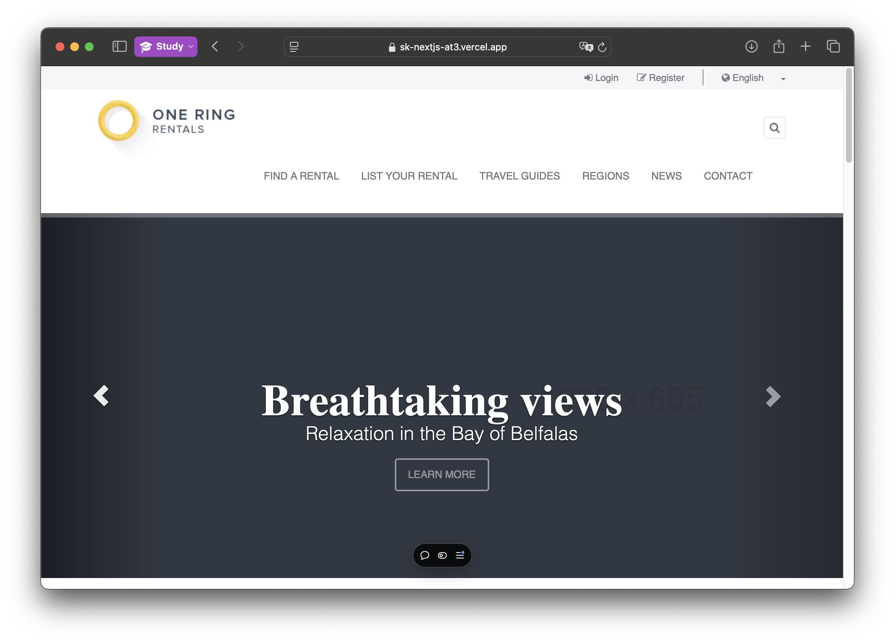
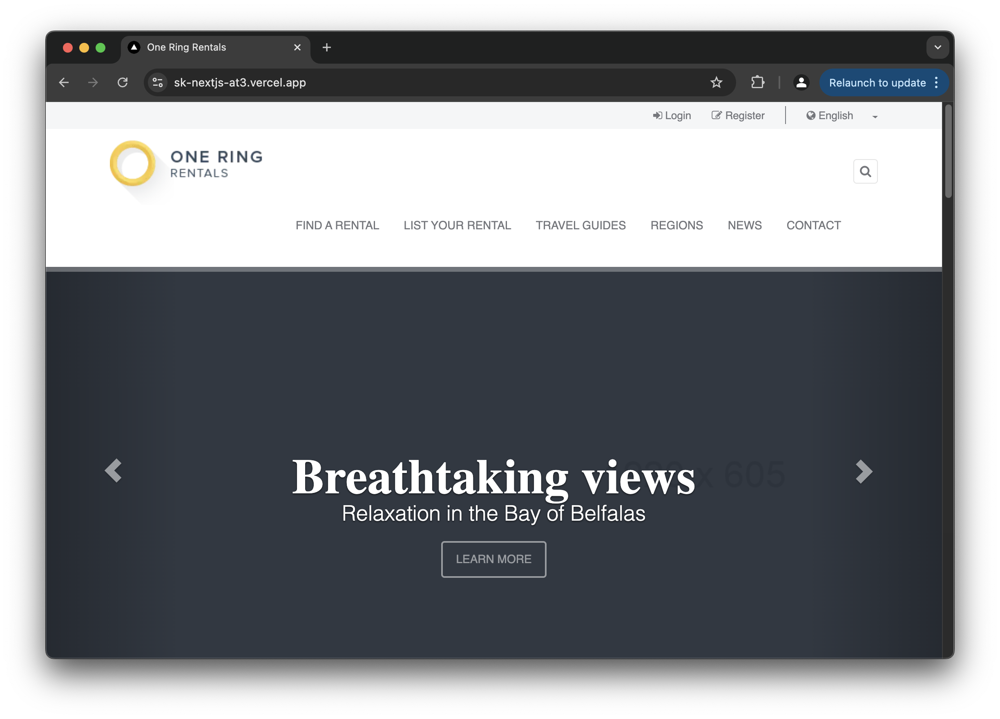

# Assessment 3: <br>One Ring Rentals Web Application

## Assessment Overview

This web application is transferred from AT2 and built using the **Next.js** framework and **React** library. It demonstrates the application of object-oriented principles, syntax, debugging, and documentation.

<hr>

## NextJS syntax

### Link tag

The syntax differs from the React library itself. In **React**, you would use:

```jsx
import { Link } from 'react-router-dom';
<Link to="">
```

However, in **Next.js**, it is used as follows:

```jsx
import Link from 'next/link';
<Link herf="">
```

### Image tag

In **Next.js**, you should use:

```jsx
import Image from 'next/image';
<image src='' width='{}' heigh='{}'></image>;
```

instead of

```html

```

<hr />

## Debugging screenshots

### Header component error


Fix: Changed the React Link import to Next.js import syntax.

### Footer component error


Fix: Changed the React Link import to Next.js import syntax.

### CSS Bootstrap error



### CSS Style error



### Content Wrapper Error



fix: Adjusted the path and removed missing file accesses from the CSS file.

<hr />

## Data state Management

Data is stored in the data folder as shown:

```
└── 📁data
    └── aboutData.jsx
    └── activitiesData.jsx
    └── articlesData.jsx
    └── newsData.jsx
    └── propertiesData.jsx
    └── regionsData.jsx
```

### Handling data

```jsx
import { propertiesData } from '@/app/data/propertiesData';
```

<hr>

## Deploy by Github with Vercel

Repo:  
[https://github.com/20111176/sk-nextjs-at3](https://github.com/20111176/sk-nextjs-at3)

Live page:  
[https://sk-nextjs-at3.vercel.app](https://sk-nextjs-at3.vercel.app)

## Access by 2 different web engine

### Safari



### Chrome


